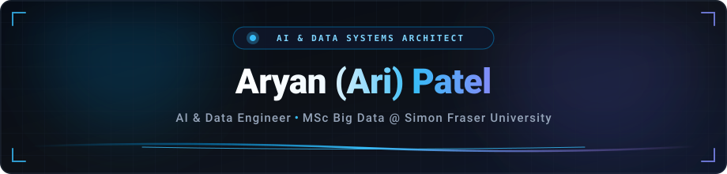
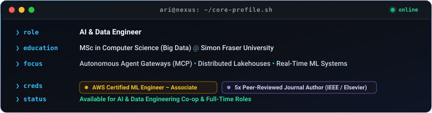

<!-- Modern Glowing Header Banner (Served Locally for 100% Uptime & Speed) -->

<!-- Dynamic Animated Typing Line -->

 

<!-- Modern Pill Badges -->

  &nbsp;
  &nbsp;
  &nbsp;
  

---

<!-- Sleek Cyber Terminal Card -->

---

### ⚡ Tech Stack

---

### 🔬 Applied Research & Publications

  
  
  

---

### 📊 GitHub Activity

 

<!-- Sleek Footer Accent Line -->

  

